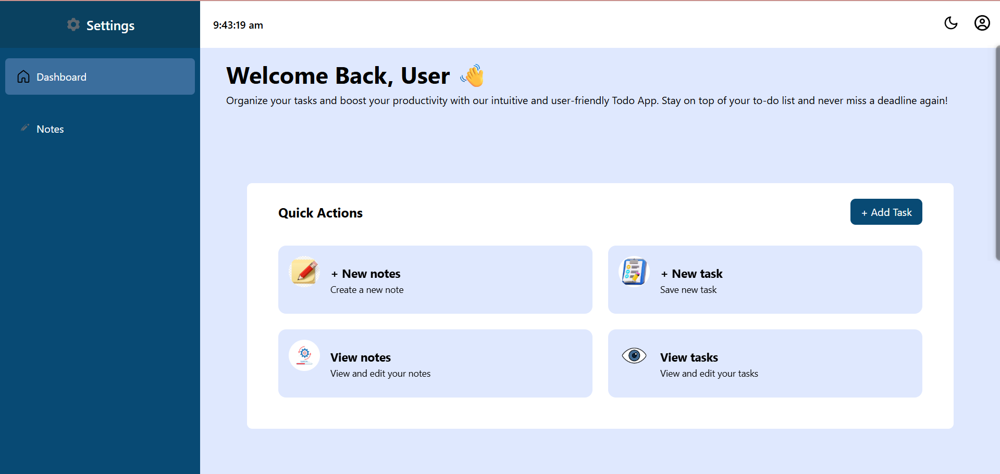
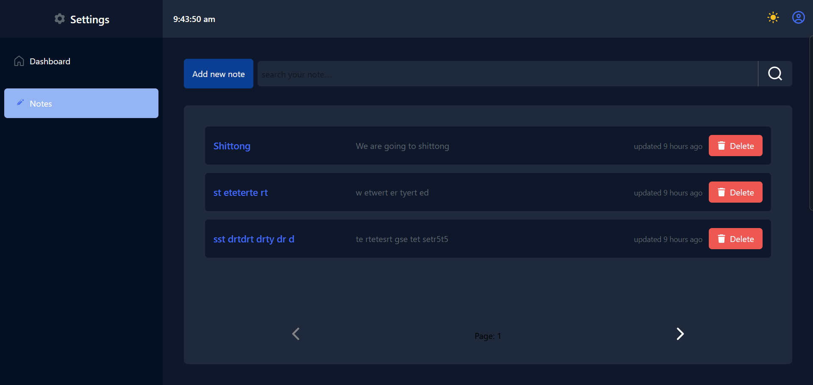

# React Notes App

A simple Notes Application built with React as part of my frontend learning journey.

This project was created to strengthen my understanding of React fundamentals, component-based architecture, state management, routing, browser storage, and UI development before moving on to larger projects such as UniAuth and OmniPost.

<p>
    
</p>

---

## Features

- 📝 Create Notes
- 🗑️ Delete Notes
- 🔍 Search Notes
- 🌙 Dark Mode / ☀️ Light Mode
- 💾 Persistent Storage using Local Storage
- 📄 Pagination Support
- ⏰ Live Clock Component
- 🧭 Multi-page Navigation using React Router
- 📱 Responsive UI

---

<p>
    
    
</p>

## Technologies Used

- React
- React Router
- JavaScript (ES6+)
- Tailwind CSS
- Local Storage API

---

## What I Learned

Building this project helped me understand:

### React Fundamentals

* Functional Components  
- JSX  
- Props  
- State Management with `useState`  
- Side Effects with `useEffect`

### Routing  

* Client-side routing using React Router  
- Navigation between pages  
- Nested route structures

### Browser APIs  

* Local Storage  
- Persisting application data  
- Theme persistence

### UI Development  

* Component-based architecture  
- Reusable SVG components  
- Theme switching  
- Responsive layouts

during the process I encountered and solved issues related to:
- State synchronization  
- Theme management  
- Local Storage persistence  
- Search functionality  
- Pagination logic  
- Component communication  
to ensure smooth operation and better user experience.

---

## Project Structure
```txt

src/
│
├── assets/
│   ├── SVG Components
├── components/
│   ├── Navbar
│   ├── Notes
│   └── Forms
├── hooks/
│   ├── Custom Hooks
├── pages/
│   ├── Landing Page
│   └── Notes Page
└── App.jsx
```
description of the project structure in markdown format.
defining the main directories and their purposes.
details about key files like App.jsx.
discussion on how this structure supports scalability and maintainability.
done